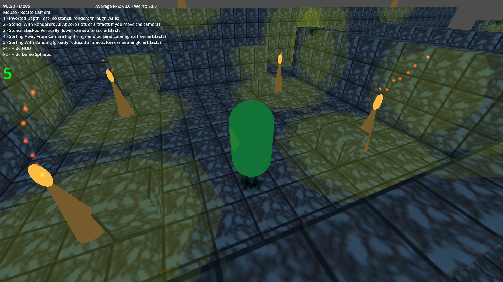
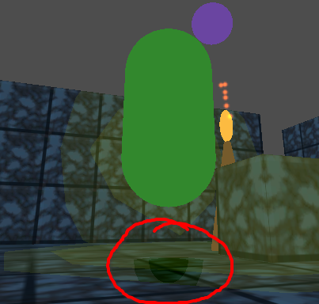
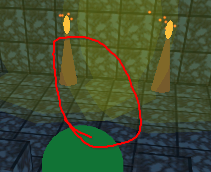

# Wind Waker Style Torches demo v0.1a

by Thomas Keene at Kobold's Keep Videogames

tkeene@kobolds-keep.net

https://bsky.app/profile/kobolds-keep.net - Let me know if you make anything with this, I'd love to see it and I might share it on my socials.

No AI or LLM was used to create this project.

# LICENSE

This work was authored by:
* Thomas Keene at Kobold's Keep Videogames

This code is free for human developers to use for commercial and non-commercial software. Please give credit to the authors in the credits, pause menu, main menu, or initial loading screen of your application.

You may distribute modified versions of this project and source code. You must retain this license section and do not remove anyone from the authors list. You may add your name to the authors list.

Using this code to train an artificial intelligence or language model has a licensing fee of one million dollars per character, split evenly among the authors.

# REQUIREMENTS

* Godot Engine 4.5
* A mouse and keyboard

# DESCRIPTION

https://koboldskeep.itch.io/wind-waker-lights-demo - Playable demo here

This project is an attempt to recreate the polygonal lights of The Legend of Zelda: The Wind Waker using Godot Engine. I'm happy that I've been able to achieve this without any shader code or shader graph, just the standard material. It is not as clean as Wind Waker's approach, which uses manually ordered draw calls, but Godot Engine does not support this and the developers have indicated a disinterest in adding the feature because it can hurt GPU performance.

I have also given the lights inner and outer rings and added simple spot shadows to the player capsule, and some flying "bat" spheres that move around the level to demonstrate the shadow feature.

There are a large number of debug features to see how each of the rendering steps work. The keyboard shortcuts to access them are displayed on-screen when the demo is run. The script that draws these is in on a node in demo_scene.tscn at /DemoScene/GUI

This project only recreates the game's stencil lights, not the rest of the cell shading and environment lighting systems (Wind Waker has A LOT of graphical features!!) For example, you would probably want your player controller to render to the depth buffer before the torches, then render their texture and lighting after the torches, and have a single light direction in their material that points at the nearest light source.

For a more in-depth analysis of these systems, please see these two videos by @JasperRLZ:

https://youtu.be/mnxs6CR6Zrk - How The Wind Waker Redefined Cel Shading

https://youtu.be/f1sUPUGu9iw - A Deeper Dive into Wind Waker's Lighting

# WHY DIDN'T YOU USE THE RENDER PRIORITY FIELD?

Because that would limit the maximum number of renderers in the scene to 256. It also causes problems for other graphical effects that rely on Render Priority. If you are using this for both light sources and character shadows, you could quickly run out of slots for the renderers.

A future version of Godot, or a fork with the necessary features, may make this project obsolete. It may also be possible to achieve this effect with some sophisticated shader code. I look forward to it! Please let me know when that happens!

# KNOWN ISSUES

The torches should be redone to have radius values like the shadow caster. They should also display this correctly in editor.

There are two minor artifacts in this version:

Both of these stem from the stencil mask of one OrderedMaterial object drawing on the stencil buffer, which is later read by a different OrderedMaterial object's renderers. Any part of the renderer outside its mask may still draw, which is the case in both of the above screenshots.

I tried resolving this by giving each torch another material that clears the stencil buffer, but my solutions only added more rendering artifacts and glitches. I leave it to wiser engineers to find fixes for these issues.

Please let me know what you come up with, I'd love to hear from you.
